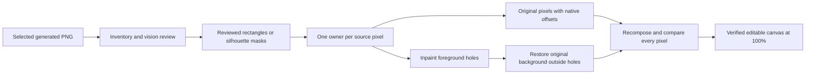

# GladMat Studio pipeline review

## Codebase and entry points

The app uses Next.js App Router, React state for the active workflow, a browser generation queue, server route handlers, private Supabase Storage, OpenAI vision/image editing, and Sharp processing. It has no database or global durable queue.

Source uploads are normalized and analyzed once. Each generated ad size is an independent image-edit job. Optional quality review and prompted regeneration operate per output. Fine-tuning creates a versioned PNG of the selected asset. Saved sources and generated assets use browser metadata with signed, scoped storage access.

`AdMatWorkspace.openStudio` stores the asset's launch capability and pushes the Studio route. `useStudioDocument` orchestrates preparation, loads private images into object URLs, and autosaves changes. `StudioCanvas` displays native coordinates through CSS zoom and exports the logical canvas at pixelRatio 1. Its layer and properties panels already support movement, proportional resizing, visibility, ordering and removal.

The Studio reference must be the selected generated/fine-tuned PNG, rather than the original campaign poster. The new cache checks the active generated output path, so opening a newly fine-tuned output cannot silently reuse a decomposition of its previous version.

## Causes of the reported failures

- Initial zoom was `fit`. Small ads could open at 200% or higher.
- Each layer was independently regenerated from the whole ad. Requests did not enforce pixel registration and could change the face, typography, position, proportions or selected content.
- The generic image finalizer center-cropped output to the ad ratio. This is especially destructive for 728 × 90 and other extreme ratios when the model canvas cannot match that ratio.
- Cropping intersected actual alpha content with a padded approximate analysis box. Visible content beyond that box was discarded.
- Cropped output was fitted and centered in the approximate box. Even a good extraction could be misplaced or rescaled.
- A prompt discouraged duplicated content, but there was no component ownership or pixel ownership check. Group photos and individual portraits could both contain the same artists.
- Background removal was unconstrained and unverified, allowing foreground ghosts in the bottom layer.
- The browser marked composition complete even after extraction failures. It could autosave partial preparation states while server work was running.
- Image hit-testing used transparent bounding rectangles, obstructing selection of elements behind transparent gaps.

## Implemented approach

The new pipeline separates semantic selection from visible artwork. Vision and image models identify what belongs to each layer. Sharp copies the original visible source pixels and controls geometry.

### Inventory

The configured vision model analyzes and then reviews the complete artwork. Its structured contract includes background description, layer type, original-pixel bounds, extraction method, and visible component IDs. Text with an integrated black fill/nameplate, shadow or outline is treated as a complete element. Actual repeated instances get distinct IDs.

Deterministic normalization removes redundant subject composites when their individual components are present, keeps integrated text treatments together, rejects background as a foreground layer, removes duplicate representations, and clamps bounds using the original right and bottom edges. The old forced layer quota is gone.

### Selection and registration

Rectangular photo/text panels receive vision review and corrected bounds when necessary. Irregular elements receive binary masks from padded detail crops, preserving contextual neighbors without sending the whole ad as an unconstrained redraw request. Vision QA compares each magenta selection overlay with the source. Failed masks receive at most one correction; masks touching an artificial crop edge get an expanded context window.

Extreme ratios are letterboxed into the model's legal aspect range together with the edit mask. Output is mapped back through that same frame. The generation center-cover finalizer is no longer used for Studio.

Foreground RGB comes exclusively from the source. Binary selection includes a one-pixel fringe to retain the source's antialiasing. The crop uses the full measured selection extent, including details beyond the approximate box. Its top-left coordinate is retained. It is never recentered or fitted into an estimated box.

### Ownership, background and verification

Overlapping masks resolve from front to back. Each source pixel appears in one foreground cutout at most. A layer that is mostly duplicated by another selection fails assembly instead of becoming another copy.

The background edit is restricted by the union mask. Original unselected pixels are restored afterward, regardless of what the image model returned. A separate vision review checks that foreground remnants are absent from the resulting plate. The plate receives at most one corrective retry.

The server then composites every original-pixel layer and compares native RGBA values to the original. The maximum difference must be zero. Only after successful verification are final layer PNGs and the complete document published. This verifies initial visual fidelity independently of AI judgment.

### Preparation, caches and editor

Independent extraction workers persist masks and metadata without rewriting the shared document. Partial selections resume within their preparation. A unique preparation ID preserves previous artifacts during rebuilds. Prior documents are archived in history; old `simple-v1` layers are never opened as current results.

The client waits for every selection, final assembly, verification, and image load before entering the editor. Autosave and manual Save are enabled after preparation. Retry preparation resumes the existing reviewed inventory and verified selections. A reviewed background checkpoint is bound to the preparation and a digest of source bytes, ordered layer IDs and masks, so assembly/storage retries reuse it without another paid background edit. PNG export refuses incomplete images and excludes the optional reference overlay.

The default zoom is 100%. Asset-specific workspace keys prevent another asset's zoom/preparation state from carrying over. Alpha-aware hit caches let canvas clicks pass through a cutout's transparent gaps. Fit and the existing editing controls remain available.

## Validation performed

- TypeScript typecheck and ESLint.
- Full Vitest suite, including deterministic image and mocked service pipeline tests.
- Production Next.js build.
- Pixel-for-pixel reconstruction using multicolor source fixtures with overlapping selections and a deliberately changed AI background.
- Native placement and complete source bounds outside approximate hints.
- Subject composite/individual deduplication, actual repeated instances, and text-with-fill grouping.
- Empty/opaque/colored mask rejection, crop-edge clipping detection, and mask dimension validation.
- 728 × 90, 320 × 50, 120 × 600, and 300 × 250 framing roundtrips.
- Parallel extraction, interrupted preparation/resume, bounded mask/panel corrections, foreground-ghost rejection, document reuse, editing/saving, artifact scoping, and cache invalidation after fine-tuning.

The existing 200 × 200 ROCKING BANGING original corresponding to the supplied screenshots was located and inspected. **Live AI extraction has not been run.** The user explicitly chose to skip the live check on September 29, 2026. No private artwork was sent to AI services, and no live Studio artifacts were written by the verification tools.

## September 29 preparation regression repair

Read-only storage diagnostics confirmed that the failing preparation's generated PNG and saved original were available. Its foreground selections did not exist. The old browser bundle still called background creation before selection, and the new server's selection reads incorrectly used the generated-asset missing message. The old client also autosaved its failed preparation state.

Every Studio request now requires API version 1, independently of stored `source-pixels-v2` documents. Older clients receive an explicit page-refresh instruction before storage/AI work. Selection, background, image and save requests carry their preparation ID; changed preparations are rejected and canceled client runs cannot apply late responses. Browser saves require the current server document to be complete and cannot rewrite prepared layer metadata.

Background preflight validates each mask and its matching metadata. Missing or invalid selections report their element names at the selection stage before any background AI call. Returned Supabase errors are classified alongside thrown errors; `NoSuchKey` (HTTP 400 with storage status 404) is a real missing object, while authentication, network and service failures remain storage errors. Internal Studio files no longer claim the generated ad is missing. Storage logs include request, preparation, stage and artifact context, with the app request reference preserved separately from the provider reference. Studio endpoints use separate rate-limit counters so a batch of cached selections cannot consume the background allowance.

The four displayed stages are Preparing artwork, Selecting editable elements, Creating background, and Building and verifying canvas. The background route streams its transition to assembly as NDJSON. The client holds the last stage open through verification, publishing and image decoding. Errors preserve stage, recovery action, affected layer IDs and the request reference. Image-loading retries do not repeat AI work; missing final PNGs can be repaired from the original inventory while preserving saved edits and deletions.

Validation: ESLint, TypeScript, all 274 tests across 39 files, and a production build passed. Regressions cover old clients, stage ordering, missing/corrupt selections, incomplete saves, changed preparations, storage error classification, assembly checkpoint reuse, repaired final images, stream truncation, cancellation, image-loading retries and rendered error/recovery presentation.

## Preparing-artwork request repair

Issue reference `574f1dce-bf73-45b6-8090-8b1aeb589c9f` was traced to `/api/studio/analyze` returning `INVALID_REQUEST` before analysis. The hook passed its full launch context to the preparation helper; spreading that object into the analysis payload introduced unsupported top-level `width` and `height` fields. The strict analysis schema rejected both new assets and saved assets needing a new analysis. The hook now passes only labels, and the helper explicitly selects `formatName` and `sourceName` when constructing the request. A focused mocked regression reproduces the original rejection with the full launch context and verifies that the corrected request is accepted. No live Studio or AI test was run for this repair.

## Practical limits

A flattened image contains no true Photoshop layer information. It cannot reveal original pixels hidden behind another foreground object. The clean background is inferred; overlapping subject details can remain a grouped element. These layers preserve visible raster appearance rather than editable font/type/vector data.

Zero pixel error verifies the starting canvas, not the correctness of every semantic boundary. Mandatory selection and background review address that separate concern, but a live success rate has not yet been measured. Difficult artwork can require a fresh preparation attempt. The new workflow uses additional paid vision checks and can take longer than the old unverified redraw pipeline.
